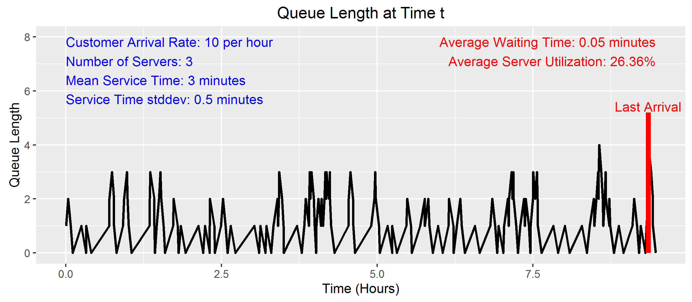
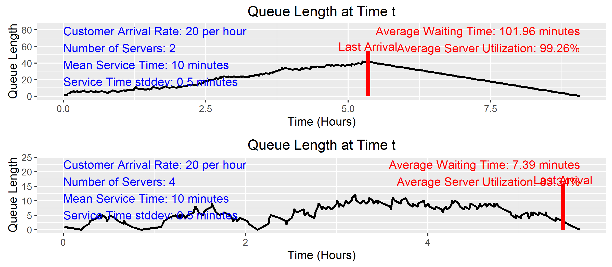

Waiting Queue Simulator (qsim)
========================================================
author: Kevin McManus
date: April 7, 2016
autosize: true

Purpose
========================================================

`qsim` simulates the arrival and servicing of  100 customers at a service station. With it you can see:
- Queue length (number of customers waiting in line) throughout the duration of the simulation
- Average customer waiting time
- Server utilization (the percentage of time the server(s) were actually servicing a customer)

Examples where qsim is useful:
- Customers coming to the checkout line at a store
- Calls coming into a call center
- Requests coming into a fulfillment center

Inputs:
- Customer arrival rate (customers per hour)
- Number of servers
- Mean customer service time in minutes
- Standard deviation of customer service time in minutes


Application: <https://kevinmcmanus.shinyapps.io/QueueSim/>

Assumptions
========================================================
`qsim` assumes the following:
- Customer arrivals follow a Poisson Process of $\lambda$ per hour
- Customer arrivals are independent of each other
- The time necessary to service a customer is Normally distributed with mean $\mu$ and
standard deviation $\sigma$
- Customers are serviced in the order in which they arrive
- Customers don't leave the system until they are serviced
- Cusotmers are serviced by the first available server


Default Usage
========================================================


```r
library(ggplot2)
library(dplyr)
source("shiny/plotsim.R")
source("shiny/qsim.R")
plotsim(qsim())
```



Effect of Going from 2 to 4 Servers
========================================================


```r
library(gridExtra)
q1=qsim(arr.rate=20, n.server = 2, svc.mean = 10)
q2=qsim(arr.rate=20, n.server = 4, svc.mean = 10)

grid.arrange(plotsim(q1), plotsim(q2), nrow=2)
```



